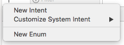

# Short
[](https://github.com/Carthage/Carthage)
[](https://developer.apple.com/)
[](https://github.com/TheAbstractDev/Short/blob/master/LICENSE)

Easly add Siri Shortcuts in your App.


## Prerequisites
- iOS 12
- Xcode 10

## Installation
### Carthage
To install Short using [Carthage](https://github.com/Carthage/Carthage), add the following line to your Cartfile:

```
github "TheAbstractDev/Short"
```

## Creating Custom Intents
Before using Short, you'll have to create a new `SiriKit Intent Definition File`.


Once the file is created, click on the + sign and select `New Intent` and add the associated properties.



Your intent must be associated with a Class !


## Usage

```swift
import Short
```

#### Getting All Voice Shortcuts
```swift
Short.getAllVoiceShortcuts { shortcuts in
    for shortcut in shortcuts {
        print(shortcut)
    }
}
```

#### Getting a Voice Shortcut from an Intent
```swift
let customIntent = CustomIntent()
Short.getVoiceShortcutFrom(intent: customIntent) 
```

### Donate Intent Interations.
Before Siri can suggest shortcuts to the user, the app must tell Siri about the shortcuts through intent donations. An app makes a donation each time the user performs an action in the app.

```swift
let customIntent = CustomIntent()
Short.donateInteraction(for: customIntent)
```

### Handle User Activity.
```swift
func application(_ application: UIApplication, continue userActivity: NSUserActivity, restorationHandler: @escaping ([UIUserActivityRestoring]?) -> Void) -> Bool {
    if let orderIntent = userActivity.interaction?.intent as? CustomIntent {
        var response = CustomIntentResponse()
        if orderIntent.quantity as! Int > 0 {
            response = CustomIntentResponse(code: .success, userActivity: nil)
        } else {
            response = CustomIntentResponse(code: .failure, userActivity: nil)
        }
        
        switch response.code {
        case .success:
	    // Do some stuff
            return true
        case .failure:
	    // Do some stuff
            return false
	default:
            break
        }
    }
    return false
}
```

### Adding Phrases to Siri.
``` swift
let customIntent = CustomIntent()
let shortcut = Short.getShortcutFrom(intent: customIntent)
if let shortcut = shortcut 
    Short.presentSiriShortcutViewController(from: self, shortcut: shortcut)
}
```

If a phrase already exists for the shortcut, the user can also change the phrase directly from your app.

```swift
let customIntent = CustomIntent()
let shortcut = Short.getShortcutFrom(intent: customIntent)
if let shortcut = shortcut 
   Short.presentExistingSiriShortcutViewController(existingShortcut: shortcut)
}
```

## Delegates methods

```swift
import IntentsUI
```

To get and receive events from the SiriVoiceShortcutViewControllers, you have to conform your ViewController to the required delegates.

### INUIAddVoiceShortcutViewControllerDelegate
```swift
extension ViewController: INUIAddVoiceShortcutViewControllerDelegate {
    func addVoiceShortcutViewController(_ controller: INUIAddVoiceShortcutViewController, didFinishWith voiceShortcut: INVoiceShortcut?, error: Error?) {
        // add shortcut
        dismiss(animated: true)
    }
    
    func addVoiceShortcutViewControllerDidCancel(_ controller: INUIAddVoiceShortcutViewController) {
        dismiss(animated: true)
    }    
}
```

### INUIEditVoiceShortcutViewControllerDelegate
```swift
extension ViewController: INUIEditVoiceShortcutViewControllerDelegate {
    func editVoiceShortcutViewController(_ controller: INUIEditVoiceShortcutViewController, didUpdate voiceShortcut: INVoiceShortcut?, error: Error?) {
        // update shortcut
        dismiss(animated: true)
    }
    
    func editVoiceShortcutViewController(_ controller: INUIEditVoiceShortcutViewController, didDeleteVoiceShortcutWithIdentifier deletedVoiceShortcutIdentifier: UUID) {
        // delete shortcut
        dismiss(animated: true)
    }
    
    func editVoiceShortcutViewControllerDidCancel(_ controller: INUIEditVoiceShortcutViewController) {
        dismiss(animated: true)
    }
}
```
